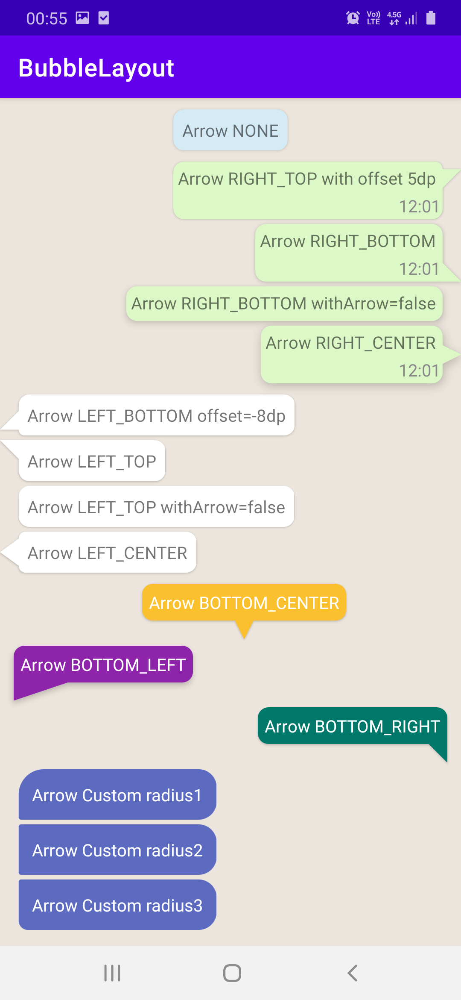
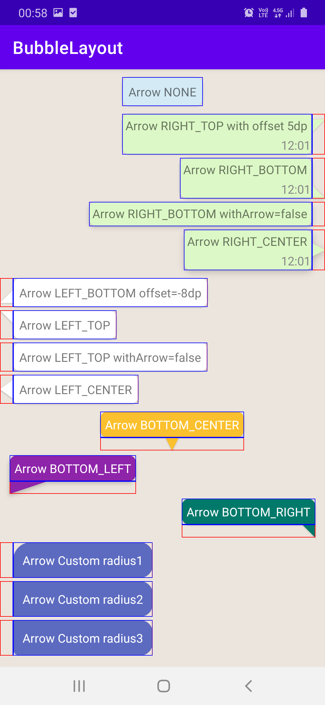

# BubbleLayout and ChatRowLayout

Chat/Speech bubble width different arrow, background, shadow properties to create chat bubbles
like whatsapp, telegram or other messaging apps have or arrows with arrow at bottom to create
info bubble.

ChatRowLayout is full row for a chat/messaging app that contains bubble as background that
measures and positions bubble based on content's position

## Bubble Layout

## ChatRowLayout

| Default | Debug   |
| ----------|----------------|
|  |  